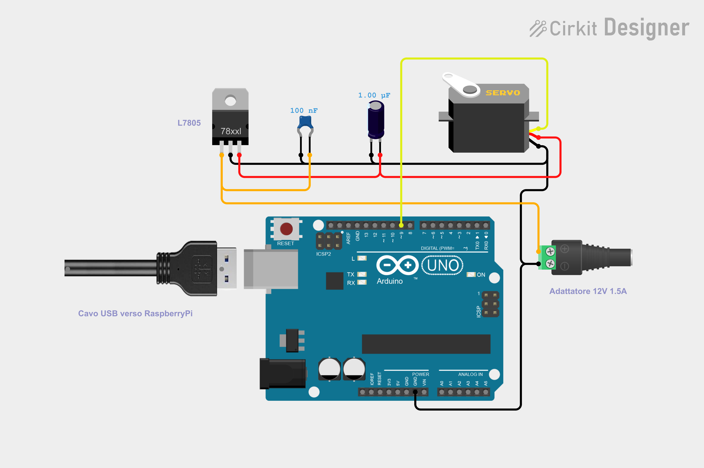

## Wiring hardware / Collegamento hardware:

## Hardware list / Lista dell'hardware
* Servomotore a rotazione continua / Continuous Rotation Servo Motor
* Condensatore ceramico da 100 nF / 100 nF ceramic capacitor
* Condensatore elettrolitico da 1 uF / 1 uF electrolytic capacitor
* Regolatore di tensione LDO a 5 V / 5V LDO voltage regulator
* Adattatore di alimentazione DC / DC Power Adapter [(like this one)](https://www.digikey.com/en/products/detail/368/1528-1386-ND/5629434).
* Adattatore di alimentazione a parete da 12 V 1A / 12V Wall Power Adapter 
* Arduino UNO (r3 o r4)

## Arduino Pins
* GNU Servo -> GNU Arduino; 
* Control PIN Servo -> Digital PIN #9 Arduino .
